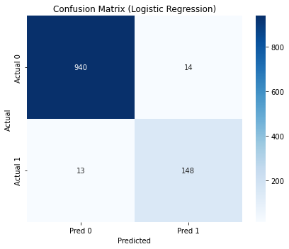
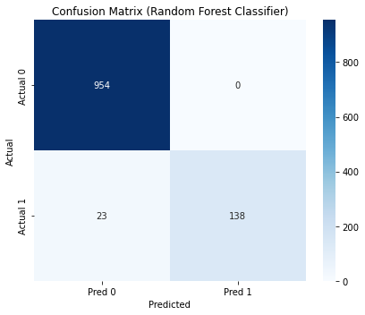

# 📧 Spam Detection using Classical NLP and Machine Learning

A project to build a spam classifier using classical Natural Language Processing (NLP) techniques like TF-IDF and machine learning models including Logistic Regression, Random Forest, and XGBoost.

## 📌 Objective

To accurately classify SMS messages as **spam** or **ham** using:
- Text preprocessing
- TF-IDF vectorization
- Classical supervised ML models

---

## 🗂️ Dataset

- **Source**: [UCI SMS Spam Collection Dataset](https://archive.ics.uci.edu/ml/datasets/SMS+Spam+Collection)
- ~5,500 labeled messages (spam / ham)

---

## 🧪 Preprocessing Steps

- Lowercasing
- Removing special characters, punctuation, and numbers
- Tokenization
- Stopword removal
- Lemmatization
- Vectorization using: **TF-IDF**

---

## 🧠 Models Used

1. **Logistic Regression**

2. **Random Forest**

3. **XGBoost Classifier**

---

## 📊 Evaluation Metrics

- **Accuracy**
- **Precision, Recall, F1-score**
- **Confusion Matrix**

---

## 🔍 Results

| Model             | Accuracy | Precision (Spam) | Recall (Spam) | F1 (Spam) |
|------------------|----------|------------------|---------------|-----------|
| Logistic Regression | 98%     | 0.92             | 0.91          | 0.92      |
| Random Forest     | 98%     | 0.99             | 0.86          | 0.92      |
| XGBoost           | 97%     | 0.90             | 0.91          | 0.90      |

> ✅ Logistic Regression gave the best trade-off between precision and recall.

---

## 📁 File Structure

